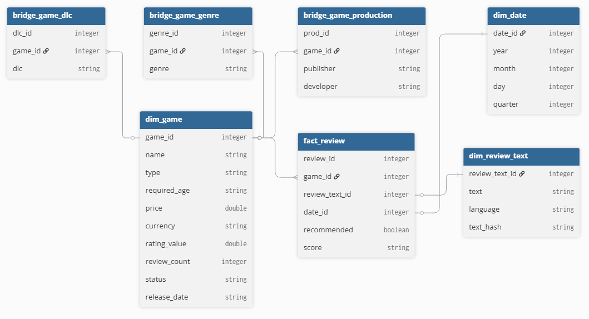

# Steam-Data-Pipeline

## Description
This is a data engineering project starting with data scraping from Steam. Next, raw data includes the information and reviews of games, which is stored in S3 as bronze layer. Data flow is consequently processing by PySpark with cleaning, normalization (silver - staging tables) and schema (golden tables). Finally, using PostgreSQL on Docker is to store data for OLAP as a warehouse. 

## Tools & Technologies
* Python
* Amazon Web Services S3
* Apache Spark
* PostgreSQL
* Docker

## Architecture

## Demo S3 (Data Lake)

### Bronze layer (Crawled data):
* raw (./datalake/raw) includes raw data crawled from Steam.
* processed (./datalake/processed) includes data processed throughout the process of web scraping.
### Silver layer (Staging tables):
* stg_content (./datalake/silver/stg_content) is the staging table of game content, which was cleaned, normalized, and exploded.
* stg_review (./datalake/silver/stg_review) is the staging table of game review, which was cleaned, normalized, and exploded.
### Golden layer (Golden tables - tables for star schema):
* bridge_game_dlc (./datalake/golden/bridge_game_dlc) is a bridge table, separated from game content, including dlcs (downloadable content) of games.
* bridge_game_genre (./datalake/golden/bridge_game_genre) is a bridge table, separated from game content, including genres of games.
* bridge_game_production (./datalake/golden/bridge_game_production) is a bridge table, separated from game content, including developers & publishers of games.
* dim_date (./datalake/golden/dim_date) is a dimension table to store the created date of reviews with date, day, month, year, quarter.
* dim_game (./datalake/golden/dim_game) is a dimension table to store the information of games.
* dim_review_text (./datalake/golden/dim_review_text) is a dimension table to store the text of reviews.
* fact_review (./datalake/golden/fact_review) is a fact table include reviews with those reliability scores.

## Final Result

