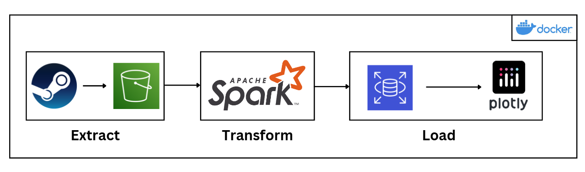

# Steam-Data-Pipeline

## Description
This is a data engineering project starting with data scraping from Steam. Next, raw data includes the information and reviews of games, which is stored in S3 as bronze layer. Data flow is consequently processing by PySpark with cleaning, normalization (staging table) and schema (golden table). Finally, using AWS RDS (PostgreSQL) is to store data for OLAP as a warehouse, then I create data marts by utilizing dbt. 

## Tools & Technologies
* Python
* Amazon Web Services S3, RDS
* Spark
* PostgreSQL
* Docker

## Architecture

## Final Result

## Implementation

### Pre-requisites

### Setup